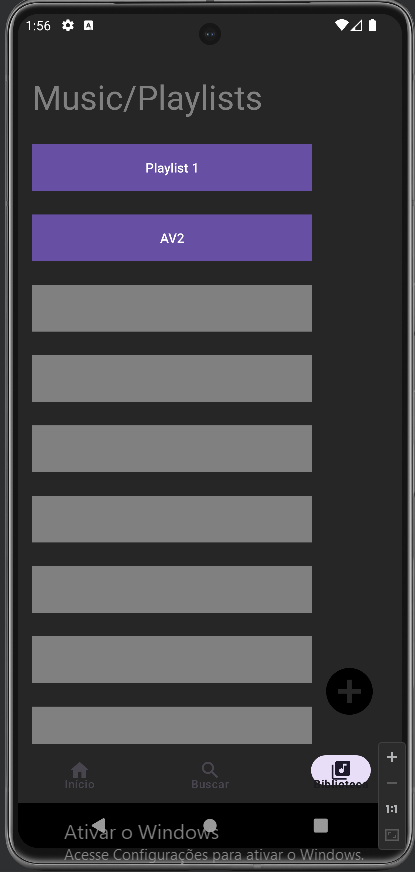
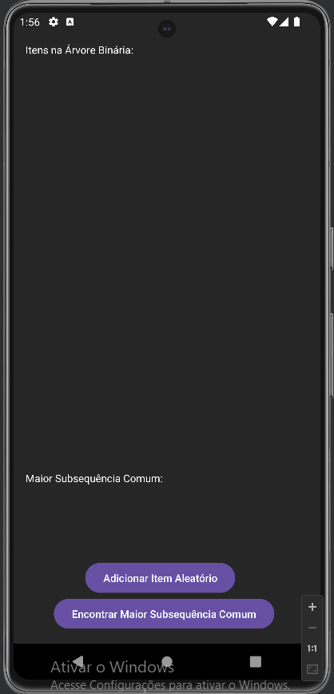
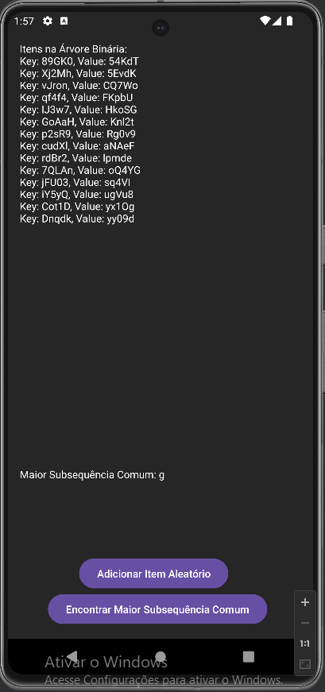

<h1 align="center">App Mobile</h1>

## :memo: Descrição
Trabalho avaliativo para obtenção da nota

<h1 align="center">Itop🎶</h1>

## :books: Contextualização
* <b>Contextualização</b>: A aplicação em si será um media player, onde o usuário poderá fazer um login na plataforma e terá acesso a músicas e Playlists disponibilizadas na plataforma.

## :wrench: Tecnologias utilizadas
* Android Studio
* Java

## Requisitos
* Autenticação (Login)
* Menu
* Navigator-bar
* Mvp
* Armazenamento
* Material Design
* Gadle
* Algoritimo de Ordenação
* Servicie
* Notificação Push

  <h1 align="center">Av2</h1>

## como acessar

Passo 1

* Acessar a biblioteca e clicar em AV2
 
 

 
 

Passo 2

* Após acessar a biblioteca o usuário tera um tela com uma listview onde após clicar no botão de "Adicionar item aleatório" ele vai acrescentar um item com Chave e Valor aleatórios onde serão organizados de forma decrescente (de cima para baixo)
 
 

 
 

Passo 3

* Na mesma tela haverá um botão para encontrar nos itens o LCS (Longest Common Subsequence), que quando precionado vai retornar a maior subsequência entre os itens aleatórios
 
 

 

## Mockup/Sotoryboard
* <a href="https://www.figma.com/file/Sq09wTWxxIbEzU8iuzI43Q/Untitled?type=design&node-id=0%3A1&mode=design&t=e5g8RoN4yRXqb93d-1">Figma</a>

## :soon: Implementação futura
* Projeto poderá conter algumas alterações de melhorias.

## :handshake: Colaboradores
<table>
  <tr>
    <td align="center">
      <a href="https://github.com/Joaogabriel148">
        
          <b>Joaogabriel148</b>
        
      </a>
    </td>
  </tr>
</table>

## :dart: Status do projeto
* em fase de desenvolvimento.
